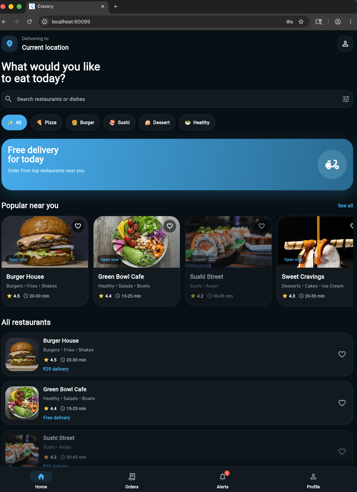
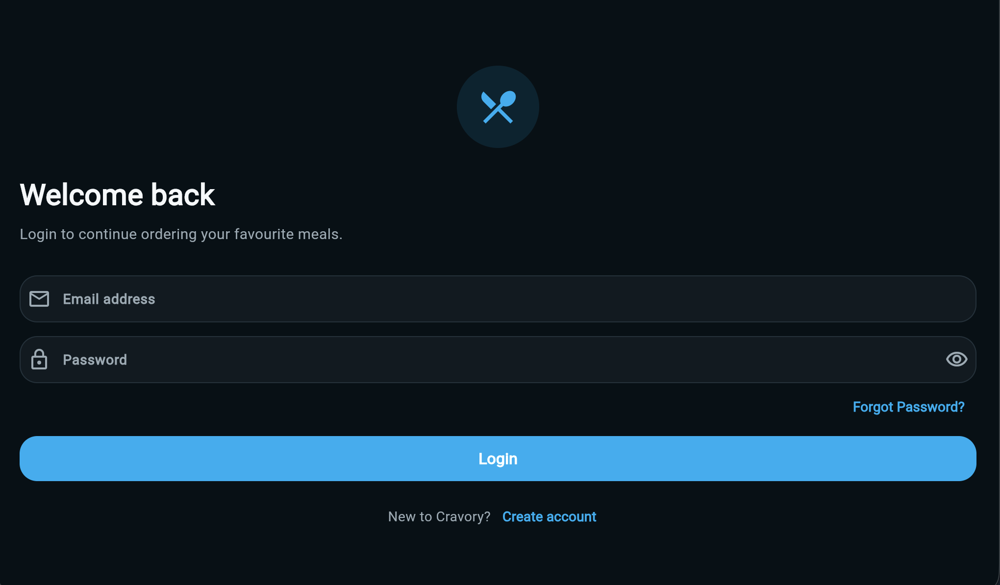
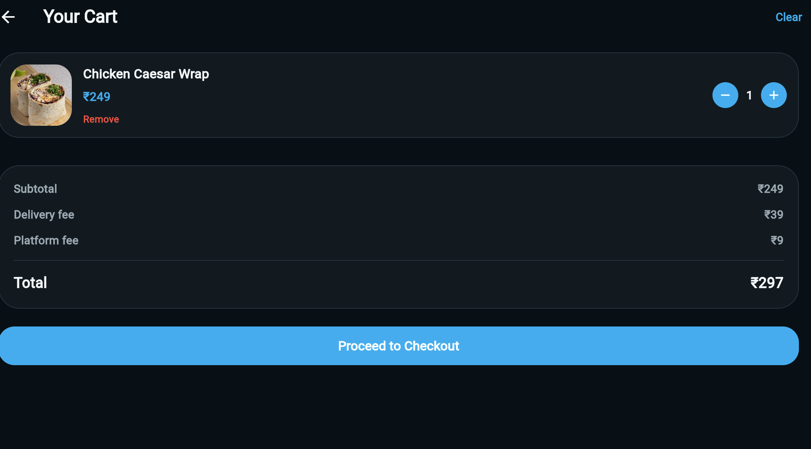
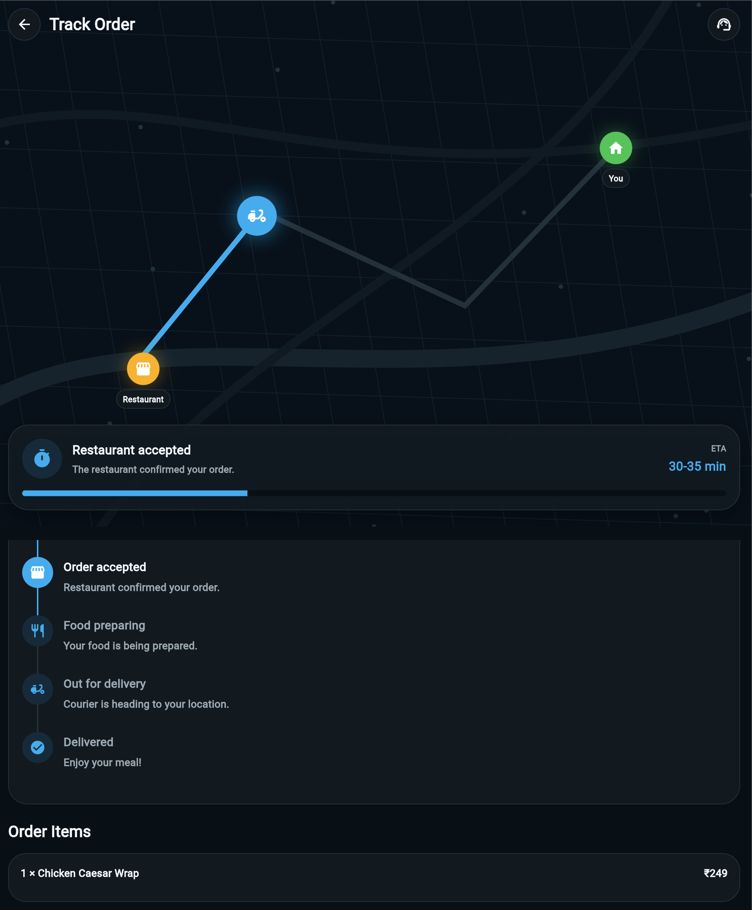
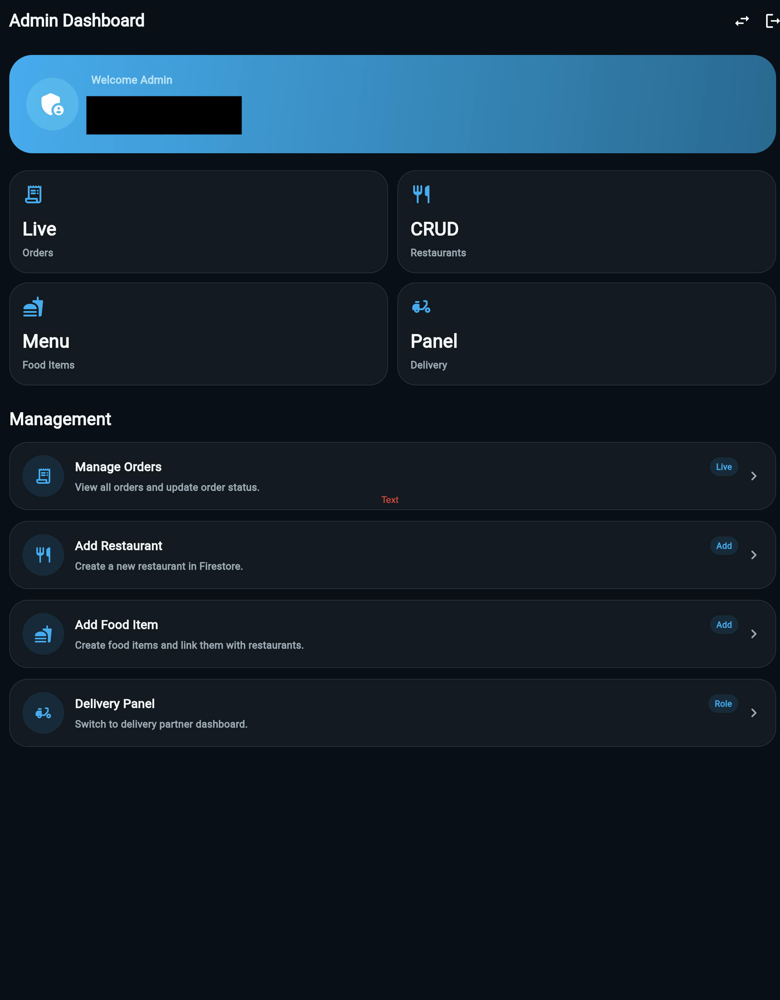
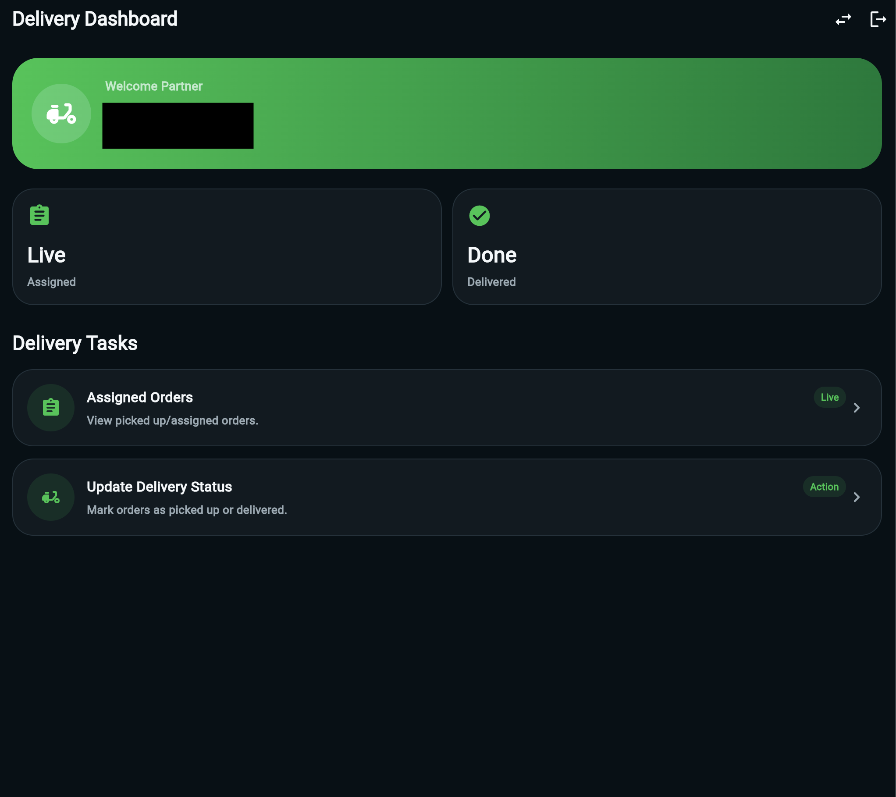

# Cravory - Food Delivery App

Cravory is a Flutter Firebase food delivery app with Customer, Admin, and Delivery panels.

## Features

- Firebase Authentication
- Role-based access: Customer, Admin, Delivery
- Restaurant listing
- Food item listing
- Cart and checkout
- Coupons
- Order placement
- Order tracking
- Reviews and ratings
- Favourites
- Notifications
- Admin dashboard
- Delivery dashboard

## Tech Stack

- Flutter
- Dart
- Firebase Authentication
- Cloud Firestore
- Riverpod
- GoRouter

## Panels

### Customer
Customers can browse restaurants, add food items to cart, apply coupons, place orders, track orders, review restaurants, and manage profile/address.

### Admin
Admin can view orders, update order status, add restaurants, and add food items.

### Delivery
Delivery partner can view active orders and update delivery status.

## Screenshots

